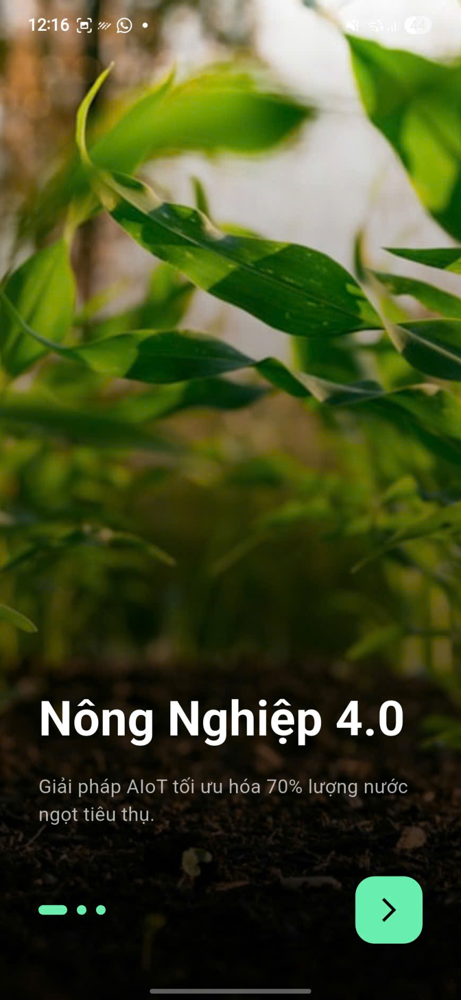
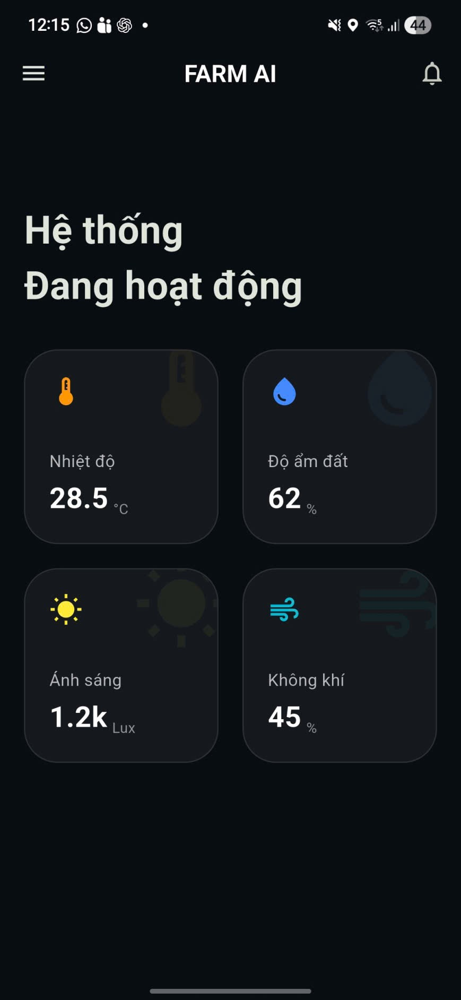
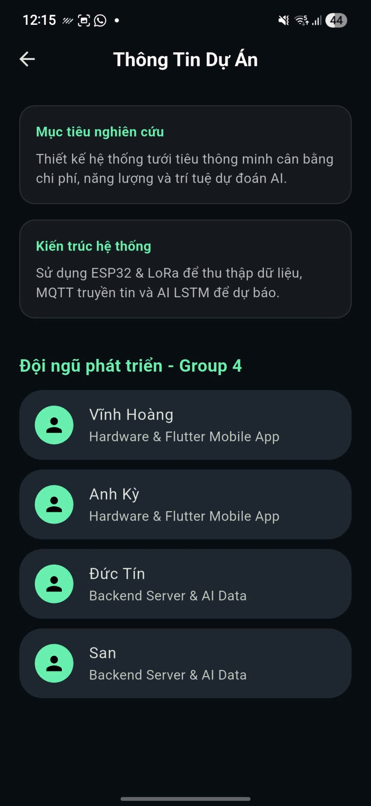
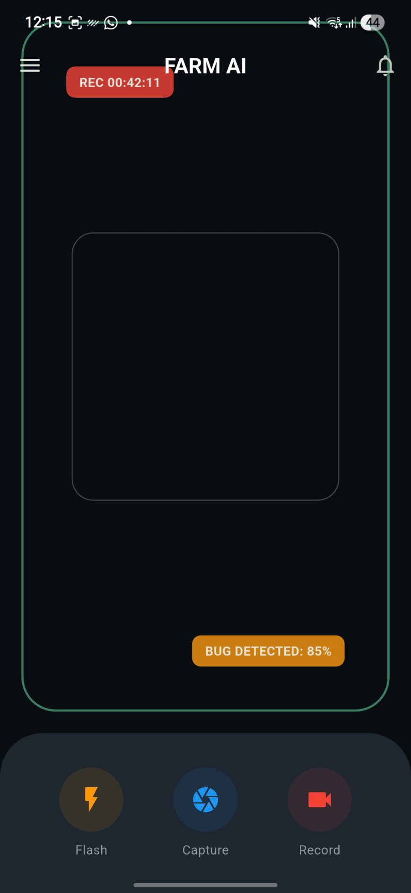

# 🌿 Smart Farm AIoT - Group 4

Dự án nông nghiệp thông minh tích hợp AI để tối ưu hóa việc tưới tiêu, giải quyết bài toán lãng phí 70% nước ngọt toàn cầu.

**Chi tiết phân công:**

- **Hoàng, Kỳ**: Phụ trách **ESP32 / Hardware** & **Flutter Mobile App**.
- **Tín, San**: Phụ trách **Backend / Server** & **AI / Data Modeling**.

## 🛠 Công nghệ cốt lõi

- **Frontend**: Flutter (Giao diện Glassmorphism hiện đại 2026).
- **Hardware**: ESP32,ESP32 CAM, LoRa(optional) (Truyền tin tầm xa, tiêu thụ điện thấp).
- **Communication**: MQTT Protocol (Lightweight & Scalable).
- **AI Model**: LSTM/ARIMA dự báo độ ẩm đất dựa trên dữ liệu chuỗi thời gian.

## 📱 Giao diện ứng dụng (Mobile App UI)

  
  
  
  

